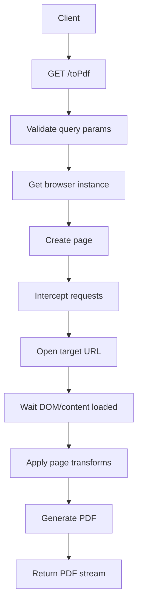
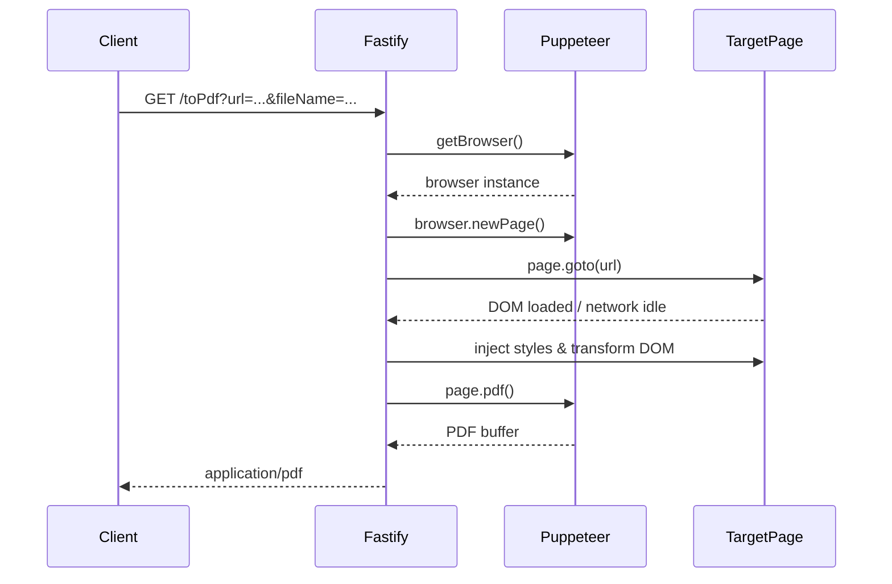

# toPdf

一个面向服务端场景的网页转 PDF 服务，基于 **Fastify** 与 **Puppeteer** 构建。项目通过真实浏览器渲染页面，在导出 PDF 前对特定 DOM、样式与资源请求进行预处理，以提升复杂页面尤其是中文办公、公文类页面的导出稳定性。

## 项目概览

`toPdf` 提供一个简单的 HTTP 接口：传入目标页面 URL，即可返回对应 PDF 文件流。相比直接抓取 HTML 或简单截图方式，本项目依赖 Puppeteer 打开真实页面，因此更适合处理：

- 需要完整前端渲染的页面
- 包含复杂样式、表格布局的页面
- 含 `canvas` 内容的页面
- 对中文字体展示有要求的页面
- 公文、通知、内部办公页面等有特殊样式处理需求的页面

## 核心能力

- 提供 `/toPdf` HTTP 接口，将指定页面导出为 PDF
- 使用 Puppeteer 进行页面加载、渲染与 PDF 生成
- 在导出前自动执行页面样式修正
- 对表格布局进行兼容处理，降低表格错位概率
- 将特定区域中的 `canvas` 转换为图片，避免导出异常
- 支持跳过部分非关键网络请求，减少噪音资源影响
- 支持自定义下载文件名
- 支持 Docker 部署，并内置中文字体支持
- 复用浏览器实例，减少重复启动浏览器的性能损耗

## 适用场景

该项目更适合以下类型场景：

- 内部系统网页导出 PDF
- 公文、通知、报表等文档页面导出
- 需要保留页面样式的打印/归档场景
- 服务端批量生成 PDF 的业务能力接入

## 项目结构

```bash
.
├── Dockerfile
├── fonts/                  # PDF 渲染所需中文字体
├── index.js                # 服务入口，定义 /toPdf 接口
├── package.json
├── public/
│   ├── removeOfficeDom.js
│   ├── resetPageStyle.js   # 重置页面样式
│   ├── resetTableStyle.js  # 重置表格样式
│   ├── scrollPageToBottom.js
│   ├── transformCanvas2Img.js      # 将 canvas 转为图片
│   ├── transformOfficeContent.js   # 处理公文内容遮挡问题
│   └── transformTable.js
└── utils.js                # 浏览器实例与公共配置
```

## 工作流程

整体流程如下：

```text
客户端请求
   ↓
GET /toPdf?url=...&fileName=...
   ↓
Fastify 接收参数并校验
   ↓
获取/复用 Puppeteer 浏览器实例
   ↓
创建新页面并开启请求拦截
   ↓
加载目标 URL
   ↓
等待 DOM 完成与网络空闲
   ↓
执行页面预处理
  - resetPageStyle
  - resetTableStyle
  - transformCanvas2Img
  - transformOfficeContent
   ↓
调用 page.pdf() 生成 PDF
   ↓
以 application/pdf 文件流返回
```

## 关键处理逻辑

### 1. 页面样式修正

项目会在导出前注入部分样式，用于修正某些页面在打印场景下的布局问题。例如：

- 修正特定 grid 布局的列配置
- 调整固定表格的宽度与列宽策略

这类逻辑主要集中在：

- `public/resetPageStyle.js`
- `public/resetTableStyle.js`

### 2. Canvas 转图片

浏览器页面中的 `canvas` 在 PDF 导出时可能出现空白、截断或显示不一致的问题。项目会在特定 DOM 区域下，将 `canvas` 转换为 `img` 后再参与导出，从而提升导出稳定性。

对应文件：

- `public/transformCanvas2Img.js`

### 3. 公文内容兼容处理

针对特定公文页面结构，项目加入了额外 DOM 处理逻辑，尽量减少正文遮挡或分页异常问题。

对应文件：

- `public/transformOfficeContent.js`

### 4. 请求拦截

项目会拦截部分非关键请求，例如头像、统计或某些静态资源，以减少无关请求对渲染和耗时的影响。

对应配置：

- `utils.js` 中的 `skippedUrls`

## API 文档

### GET /health

服务健康检查接口，可用于容器探活、负载均衡检查或部署后的基础可用性验证。

#### 示例请求

```bash
curl "http://localhost:3000/health"
```

#### 示例响应

```json
{
  "code": 200,
  "msg": "ok",
  "data": {
    "status": "up",
    "service": "toPdf",
    "timestamp": "2026-03-31T00:00:00.000Z"
  }
}
```

### GET /debug

浏览器调试页面，可直接在网页中填写参数并测试 `POST /toPdf`。

#### 示例请求

```bash
open "http://localhost:3000/debug"
```

### POST /toPdf

用于高级转换场景，支持通过 JSON body 传递更多配置项。

#### 请求体字段

| 字段 | 类型 | 必填 | 说明 |
| --- | --- | --- | --- |
| url | string | 是 | 需要转换为 PDF 的页面地址 |
| fileName | string | 否 | 下载文件名，默认值为 `doc` |
| scrollToBottom | boolean | 否 | 是否在导出前滚动到页面底部，适用于懒加载页面 |
| headers | object | 否 | 额外请求头，会在页面请求时携带 |
| timeout | number | 否 | 页面加载超时时间，单位毫秒，默认 `60000` |
| enableRequestInterception | boolean | 否 | 是否启用内置资源拦截，默认 `true` |

#### POST 示例请求

```bash
curl -X POST "http://localhost:3000/toPdf" \
  -H "Content-Type: application/json" \
  -d '{
    "url": "https://example.com",
    "fileName": "test",
    "scrollToBottom": true,
    "headers": {
      "Authorization": "Bearer xxx"
    },
    "timeout": 60000,
    "enableRequestInterception": true
  }' \
  --output test.pdf
```

### GET /toPdf

将指定页面导出为 PDF。

#### 请求参数

| 参数 | 类型 | 必填 | 说明 |
| --- | --- | --- | --- |
| url | string | 是 | 需要转换为 PDF 的页面地址 |
| fileName | string | 否 | 下载文件名，默认值为 `doc` |

#### 示例请求

```bash
curl "http://localhost:3000/toPdf?url=https://example.com&fileName=test"
```

#### 成功响应

响应头：

```http
Content-Type: application/pdf
Content-Disposition: attachment; filename="test.pdf"
```

响应体为 PDF 二进制流。

#### 失败响应

```json
{
  "msg": "转换过程中出现错误",
  "code": 500
}
```

## 快速开始

### 环境要求

建议准备以下运行环境：

- Node.js 18+
- pnpm 10+（项目已在 `package.json` 中声明 `engines` 要求）
- 可正常启动 Puppeteer 的 Linux / macOS 环境

### 环境变量

| 变量名 | 默认值 | 说明 |
| --- | --- | --- |
| `PORT` | `3000` | 服务监听端口 |
| `HOST` | `0.0.0.0` | 服务监听地址 |
| `LOG_LEVEL` | `info` | Fastify 日志级别 |
| `LOG_DIR` | `/data/logs` | 日志目录，日志文件名固定为 `topdf.log` |

> 如果你希望减少本地浏览器环境差异，推荐优先使用 Docker 部署。
>
> 若本地尚未安装 pnpm，可通过 Corepack 启用：
>
> ```bash
> corepack enable
> corepack prepare pnpm@10.12.1 --activate
> ```

### 1. 安装依赖

```bash
pnpm install
```

### 2. 启动服务

```bash
pnpm start
```

如需自定义日志目录，可在启动时传入环境变量：

```bash
LOG_DIR=./data/logs pnpm start
```

默认监听地址：

```bash
http://0.0.0.0:3000
```

### 3. 调用接口

浏览器访问或使用 curl 调用：

```bash
curl -o output.pdf "http://localhost:3000/toPdf?url=https://example.com&fileName=output"
```

## Docker 部署

项目自带 `Dockerfile`，并在镜像中完成以下工作：

- 使用 Puppeteer 运行基础镜像
- 启用 Corepack 并激活 pnpm
- 配置 `PNPM_HOME` 与全局可执行路径
- 拷贝 `package.json` 与 `pnpm-lock.yaml`
- 使用 pnpm 安装生产依赖
- 复制中文字体到系统字体目录
- 刷新字体缓存
- 使用 `pm2-runtime` 启动服务

### 构建镜像

```bash
docker build -t topdf .
```

### 运行容器

```bash
docker run -p 3000:3000 topdf
```

### 后台运行示例

```bash
docker run -d --name topdf -p 3000:3000 topdf
```

## Docker Compose

项目已提供 `docker-compose.yml`，用于快速启动服务与日志挂载。

### 启动

```bash
docker compose up -d
```

### 停止

```bash
docker compose down
```

### 查看日志

```bash
docker compose logs -f topdf
```

Compose 默认会：

- 暴露 `3000` 端口
- 挂载本地 `./data/logs` 到容器 `/data/logs`
- 配置健康检查调用 `/health`
- 设置自动重启策略 `unless-stopped`

## Makefile

项目已提供常用命令封装，可直接执行：

```bash
make install
make start
make health
make docker-build
make docker-up
make docker-down
make logs
```

## GitHub Actions

项目已提供基础 CI 工作流：`.github/workflows/ci.yml`。

该工作流会在以下场景自动执行：

- push 到 `main`
- 发起或更新 Pull Request

当前 CI 包含两个检查任务：

1. **Node service check**
   - 安装 pnpm 与 Node.js
   - 执行 `pnpm install --frozen-lockfile`
   - 启动服务
   - 检查 `/health` 接口是否可用

2. **Docker build check**
   - 执行 `docker build -t topdf .`
   - 验证 Dockerfile 与构建流程是否正常

这样可以在代码提交后尽早发现：

- 依赖安装失败
- 服务无法启动
- 健康检查异常
- Docker 镜像无法构建

## 示例

### 接口调用示例

```bash
curl "http://localhost:3000/toPdf?url=https://example.com/report&id=1001&fileName=monthly-report" --output monthly-report.pdf
```

### 调用流程图



### 时序图



### 示例截图占位

你可以在仓库中补充如下图片资源，并在 README 中替换为真实截图：

```text
assets/
├── demo-request.png
├── demo-page.png
└── demo-pdf.png
```

如果后续补充了截图，可将下面这段取消注释后使用：

```md
## 页面示例

### 原始页面


### 导出结果

```

## 日志与性能

当前服务在运行过程中会记录关键耗时信息，例如：

- 浏览器实例化耗时
- DOM 加载完成耗时
- 页面全部加载完成耗时
- 请求总耗时
- PDF 生成耗时

这有助于排查慢页面、资源异常或导出失败问题。

## 注意事项

- 目标页面必须能被服务端运行环境访问
- 若目标页面依赖登录态、Cookie、Token 或特殊请求头，当前版本可能无法直接访问
- 页面脚本执行时间过长、资源过多、第三方资源异常时，会影响生成速度
- 当前内置的 DOM 修正逻辑带有业务场景特征，更适合结构相对明确的内部页面
- 如果页面中存在跨域资源、懒加载内容或复杂交互逻辑，可能需要进一步定制处理
- 当前超时时间为 60 秒，超时页面会返回失败响应

## 依赖说明

主要依赖如下：

- [fastify](https://www.fastify.io/)：提供 HTTP 服务
- [puppeteer](https://pptr.dev/)：驱动浏览器加载页面并生成 PDF
- [axios](https://axios-http.com/)：已作为依赖引入，可用于后续扩展远程请求能力

## 可改进方向

- 增加健康检查接口，如 `/health`
- 支持 POST 请求，避免过长 URL 传参
- 支持 Cookie、Header、Token 注入
- 支持更多页面加载完成策略配置
- 增加任务队列与并发控制
- 增加更完善的日志、监控和错误追踪能力
- 增加测试用例与示例页面
- 为 README 补充真实截图与部署示意图

## License

ISC
